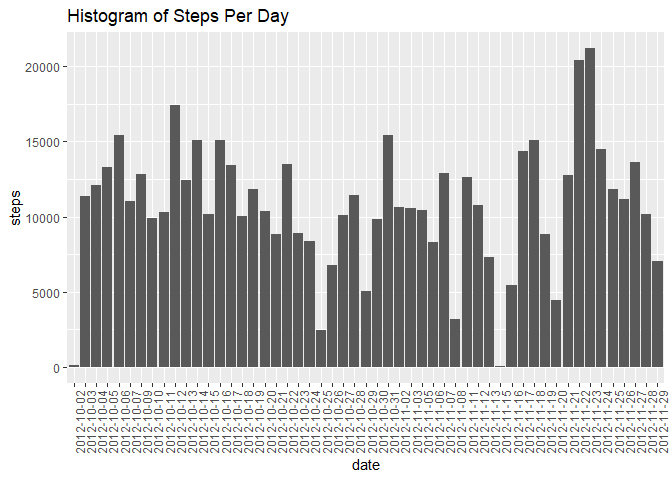

## Reproducible Research Course Project 1

**Load and Process the Data** 

```r
    stepdata<-read.csv("repdata_data_activity//activity.csv",header=TRUE,stringsAsFactors = FALSE)
    stepdata_noNA<-stepdata[!is.na(stepdata),]
```

**What is the mean total number of steps taken per day?**

```r
   library(ggplot2)
   Steps_Per_Day<-aggregate(steps~date,data=stepdata_noNA,FUN=sum)
  ggplot(Steps_Per_Day,aes(x=date,y=steps)) + geom_bar(stat='identity') + theme(axis.text.x=element_text(angle=90)) + ggtitle("Histogram of Steps Per Day")
```

<!-- -->

The mean number of steps taken per day is : 1.0766189\times 10^{4}

The median number of steps taken per day is : 10765

**What is the average daily activity pattern?**

```r
  Steps_Per_Interval<-aggregate(steps~interval,data=stepdata_noNA,FUN="mean")
  plot(Steps_Per_Interval$interval,Steps_Per_Interval$steps,type="l",ylab="Average Number of Steps Taken",xlab="Time Interval")
```

<!-- -->

```r
  MaxInterval<-Steps_Per_Interval[which(Steps_Per_Interval$steps==max(Steps_Per_Interval$steps)),1]
```

The 5-minute interval, on average across all days in the dataset, that contains the highest number of steps is 835

**Imputing Missing Values**

```r
   library(plyr)   
```

```
## Warning: package 'plyr' was built under R version 3.4.4
```

```r
   MissingRows<-length(which(is.na(stepdata$steps)))
   # Use the average number of steps on that day to fill in missing values
   stepdata_full<-stepdata
   # Figure out which 5-minute intervals correspond to the missing data
   MissingIndices<-which(is.na(stepdata_full$steps))
   MissingIntervals<-as.data.frame(stepdata_full[MissingIndices,3])
   names(MissingIntervals)<-c("interval")
   MissingValues<-join(MissingIntervals,Steps_Per_Interval)
```

```
## Joining by: interval
```

```r
    for (k in 1:NROW(MissingValues)) {
      stepdata_full[MissingIndices[k],]$steps<-MissingValues[k,]$steps
    }
   Steps_Per_Day_Full<-aggregate(steps~date,data=stepdata_full,FUN="sum")
   names(Steps_Per_Day_Full)[1]<-c("date")
  ggplot(Steps_Per_Day_Full,aes(x=date,y=steps)) + geom_bar(stat='identity') + theme(axis.text.x=element_text(angle=90)) + ggtitle("Histogram of Steps Per Day After Imputing Data")
```

<!-- -->
The mean number of steps taken per day after imputing data is : 1.0766189\times 10^{4}

The median number of steps taken per day after imputing data is : 1.0766189\times 10^{4}

If we use the average number of steps in a given interval to fill in the unknown intervals, the impact of including imputed values into the missing data for the mean and median values is negligible. 

**Are there differences in activity patterns between weekdays and weekends?**

```r
   stepdata_full$weekday<-weekdays(as.POSIXct(stepdata_full$date))
   stepdata_full$binaryday<-"weekend"
   stepdata_full[which(stepdata_full$weekday!="Saturday" & stepdata_full$weekday!="Sunday"),]$binaryday<-"weekday"
   WeekendIntervalAverage<-aggregate(steps~interval,stepdata_full[which(stepdata_full$binaryday=="weekend"),],FUN="mean")
   WeekdayIntervalAverage<-aggregate(steps~interval,stepdata_full[which(stepdata_full$binaryday=="weekday"),],FUN="mean")
  par(mfrow=c(2,1))   
  plot(WeekendIntervalAverage$interval,WeekendIntervalAverage$steps,type="l",xlab="Time Interval",ylab="Steps",main="Weekend Average Steps Per 5-minute Interval")
  plot(WeekdayIntervalAverage$interval,WeekdayIntervalAverage$steps,type="l",xlab="Time Interval",ylab="Steps",main="Weekday Average Steps Per 5-minute Interval")
```

<!-- -->
